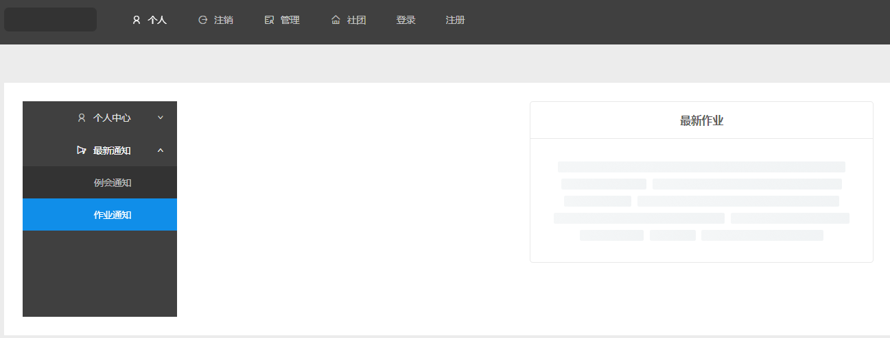
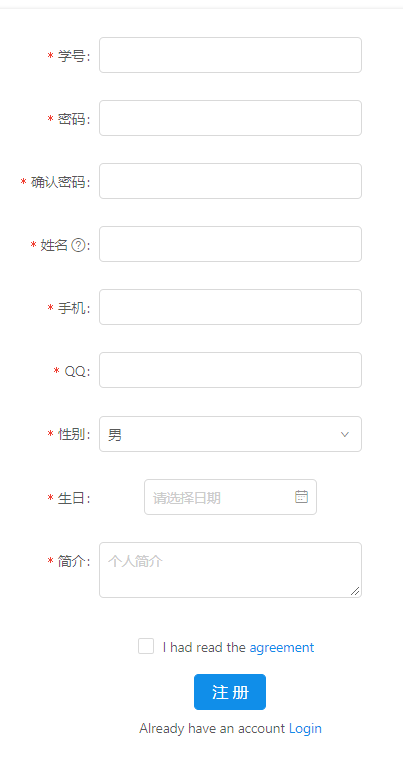
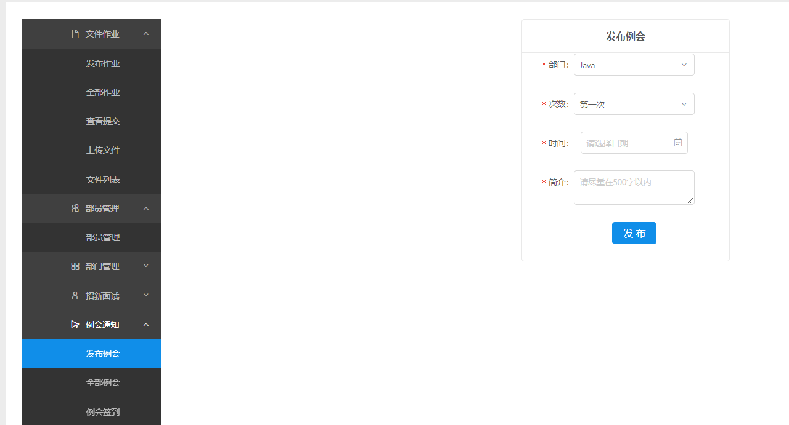
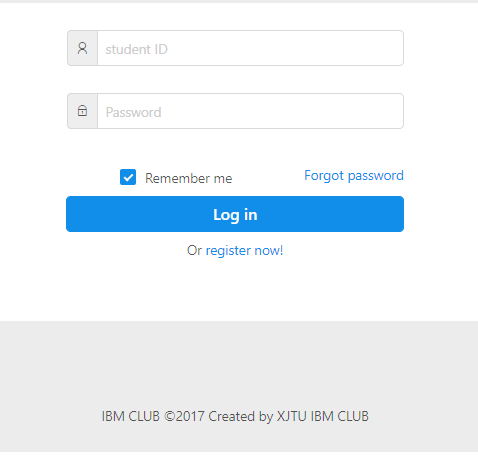
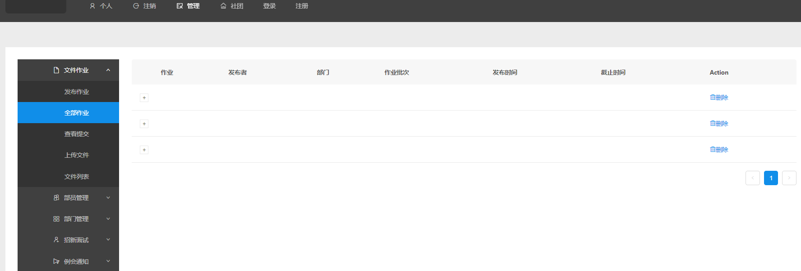
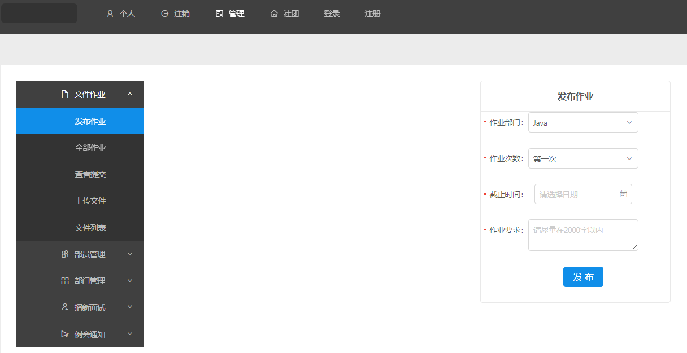
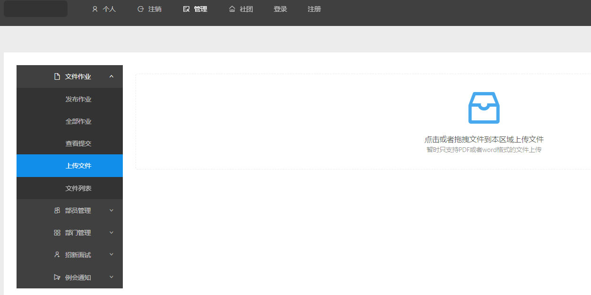
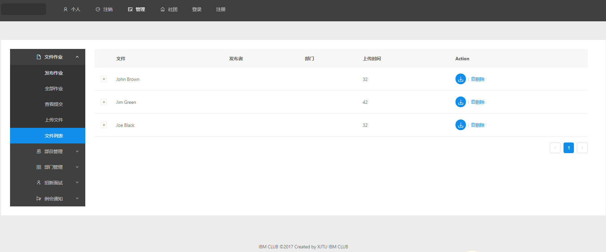

# IBM CLUB WEB

This repository is the demo of IBM CLUB WEB.

Java and SSH framworks are used to process the requests and manage MySQL database.

1. user

   

2. register

   

3. meetingissue

   

4. login

   

5. issuelist

   

6. index

   

7. homeworklist

   

8. homeworkissue

   

9. fileupload

   

10. filelist

   

